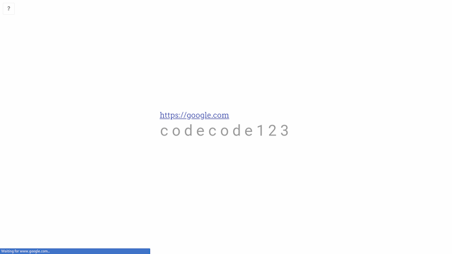

# Letters

When deployed, the Vercel(previously Now Zeit) app prompts for a 11-character code for which it redirects you to a configured link.

#### Prompt:

#### Entering the code:

#### Right code:

Once right code is entered, the link is displayed on screen as well as redirection is made.

## Deployment

1. Set up now/vercel on your environment;
2. Clone the repo;
3. Copy `data.raw.example` to `data.raw` and fill it in with tab-separated rows of name, code, url;
3. Run [`./update.secrets`](./update.secrets) or create secret in Vercel from `data.raw`;
4. Deploy running `now`.

Demo: [https://letters-test.t56.now.sh/](https://letters-test.t56.now.sh/) (Try `codecode123` for successful entry)
